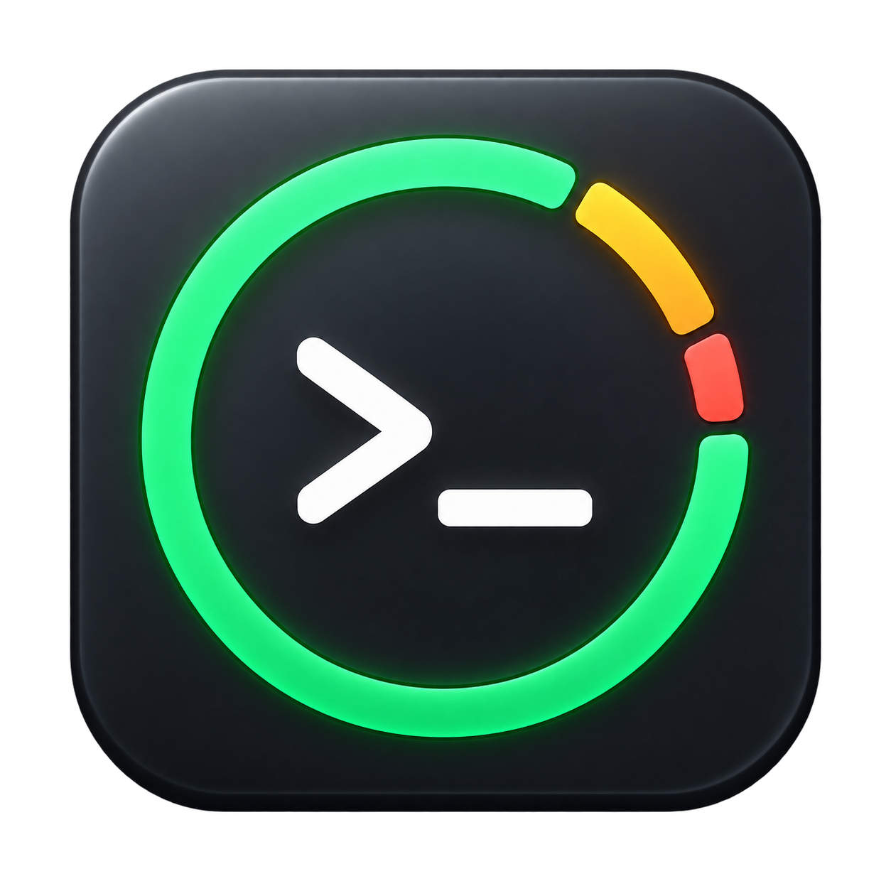

<p align="center">
  
</p>

<h1 align="center">AILimits</h1>
<p align="center"><strong>Your Codex quota. Always in sight.</strong></p>
<p align="center">A compact Windows 11 taskbar companion that shows your remaining Codex limits, reset time, and connection status at a glance.</p>
<p align="center"><a href="https://github.com/SerbulEvhenii/AILimits/releases/tag/v0.1">Download v0.1</a> · <a href="#getting-started">Getting started</a> · <a href="#privacy">Privacy</a> · <a href="https://github.com/SerbulEvhenii/AILimits/issues">Report an issue</a></p>

## Stay focused, stay informed

AILimits sits beside Windows Widgets on your taskbar, keeping your Codex allowance visible while you work. No separate dashboard to keep open.

- **Remaining quota** for the five-hour and weekly windows, displayed as percentages.
- **Color cues** for the five-hour allowance: green at 90–100%, amber at 40–89%, and red below 40%.
- **Reset time** shown in your local time zone.
- **Connection indicator** and explicit stale-data messages when a refresh fails.
- **Light and dark taskbar support**, with a compact rounded design.
- **Flexible refresh interval**, from 15 seconds to one hour; 60 seconds by default.
- **Account choice:** use your existing Codex sign-in or sign in to a separate widget profile.
- **Optional startup shortcut**, installed for your Windows user without administrator access.

For example, `5г: 84% · 7д: 97%` means **84% remaining in the five-hour window** and **97% remaining in the weekly window**. The v0.1 interface is in Ukrainian (`г` = hours, `д` = days).

## Getting started

### Requirements

- Windows 11, **x64**, with .NET Framework 4.8.
- The main horizontal taskbar, with **Widgets enabled and Start centered**, and enough space between them.
- Codex installed and signed in with a ChatGPT account that provides usage-limit data. AILimits searches the standard desktop installation path, then `codex.exe` on `PATH`.

### Run the executable

1. Download **AILimits-v0.1-win-x64.exe** from [Releases](https://github.com/SerbulEvhenii/AILimits/releases/tag/v0.1).
2. Run the executable. The indicator appears beside Windows Widgets when the supported layout is available.
3. Right-click it to open **Налаштування…** (Settings), **Оновити** (Refresh), or **Закрити індикатор** (Exit).

The v0.1 executable is unsigned, so Windows may show an unknown-publisher warning. Download only from this repository's releases; SHA-256 checksums are included.

### Install with automatic startup

Download and extract **AILimits-v0.1-win-x64.zip**, then run PowerShell in the extracted folder:

```powershell
.\scripts\install.ps1
```

The installer copies the application to `%LOCALAPPDATA%\AILimits` and creates a shortcut in your user's Startup folder. To remove the executable and startup shortcut:

```powershell
.\scripts\uninstall.ps1
```

Uninstalling preserves local settings and account profiles. To erase those too, close AILimits and manually delete `%LOCALAPPDATA%\AILimits`.

## Account and refresh settings

Open Settings from the right-click menu, or run `AILimits.exe --settings`.

**Акаунт із застосунку Codex** uses your existing Codex account. **Увійти в інший акаунт…** opens the official browser sign-in flow for a separate widget profile. Complete sign-in and click **Зберегти** (Save) to apply it. The separate profile does not replace your main Codex sign-in.

## Privacy

AILimits communicates with the local `codex app-server` over standard input/output. Codex handles authentication and communicates with OpenAI. AILimits has no separate analytics service or telemetry endpoint, does not submit prompts or start generation tasks, and does not redeem usage resets.

Personal runtime data stays outside the repository, under `%LOCALAPPDATA%\AILimits`:

| File or folder | Contents |
| --- | --- |
| `settings.json` | Refresh interval, selected profile, and possibly the account email/plan label |
| `accounts/<id>/` | Separate Codex profiles; `auth.json` may contain sensitive access tokens |
| `status.json` | Last successful quota display and update time |
| `attachment*.txt` | Local taskbar attachment diagnostics |
| `probe*.json`, `probe*.txt` | Account response or error from the optional diagnostic command |

Never share account profiles, authentication files, or raw diagnostic responses. Canceled sign-in attempts may leave a local profile directory. Review screenshots and logs before attaching them to an issue.

Source releases and binary packages do not include these runtime files. `.gitignore` excludes account files, local settings, diagnostics, private keys, build outputs, and local development captures stored in `bin/`.

## Build from source

The build uses the C# compiler supplied with the 64-bit .NET Framework installation and Windows system assemblies. No NuGet dependencies are required.

```powershell
.\scripts\build.ps1
.\bin\AILimits.exe --test
Get-Content "$env:LOCALAPPDATA\AILimits\tests.txt"
```

The executable is written to `bin/AILimits.exe`. Embedded checks cover quota formatting, color thresholds, reset timestamps, settings validation, and settings serialization. They use synthetic fixtures and do not query your account.

To recreate the release executable, ZIP package, and checksums:

```powershell
.\scripts\release.ps1
```

Outputs are written to `dist/`. The existing logo and icon are embedded or referenced directly; `scripts/build-icon.ps1` regenerates the multi-resolution Windows icon if the logo changes.

## How it works

AILimits is a C# / .NET Framework desktop process. It embeds a Win32 child window into `Shell_TrayWnd` using `SetParent` and locates the Widgets and Start buttons through UI Automation. It does not inject code into Explorer or modify system files.

Each refresh starts a short-lived local Codex app-server session, reads `account/rateLimits/read`, and closes the session. If the required taskbar elements or enough free space are unavailable, the indicator hides to avoid covering taskbar buttons.

## v0.1 limitations

This is an early release using an unofficial taskbar integration. Windows updates may require compatibility fixes. Multi-monitor layouts, DPI changes, auto-hide, fullscreen behavior, and Explorer restarts have not received complete interactive validation. Restart AILimits if it does not reattach after Explorer restarts. End-to-end switching to another account also requires further user testing.

AILimits is an independent project and is not affiliated with or endorsed by OpenAI or Microsoft. Codex and Windows belong to their respective owners.
